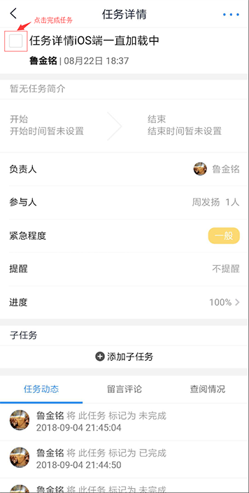

## 任务详情

包括单个任务的内容详情
1. 任务标题
2. 任务创建人与创建时间
3. 任务简介
4. 任务的开始于结束时间
5. 任务负责人（一个）
6. 任务参与人（多个）
7. 任务的紧急程度
8. 任务是否设置提醒
9. 任务的当前进度（可修改当前进度，若修改为100%则表示当前任务已完成）
10. 查看当前任务的子任务（添加子任务）或父任务
11. 查看当前任务的动态，查看与新增留言评论，查看查阅情况

